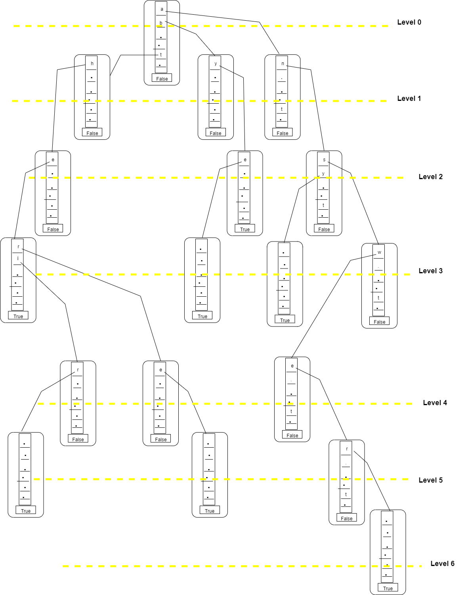

# TrieDataStructure
Implementation of TRIE data structure with self explanatory system.out.printlns

Refer to below image for a test case with 8 word input as : the a there answer any by bye their

